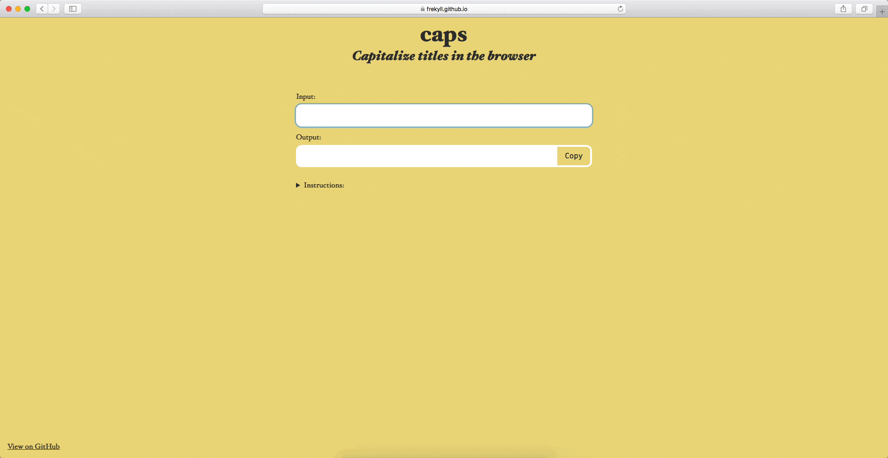

# caps
> Capitalize titles in the browser

This is an experimental site built on [Browserify](http://browserify.org) technologies, including [nanohtml](https://github.com/choojs/nanohtml) and [sheetify](https://github.com/stackcss/sheetify). I used Andy Axton's [capitalize-title](https://github.com/a-axton/capitalize-title) package for converting the string to title case.

## What It Does
- Capitalizes titles according to a defined [set of rules](https://github.com/a-axton/capitalize-title#rules)
- Replaces special characters such as curly quotes and dashes with a plain text equivalent

## Related
- [capitalize-title](https://github.com/a-axton/capitalize-title)
- [slugs](https://github.com/frekyll/slugs)

## License

MIT © [Frekyll](https://github.com/frekyll)
